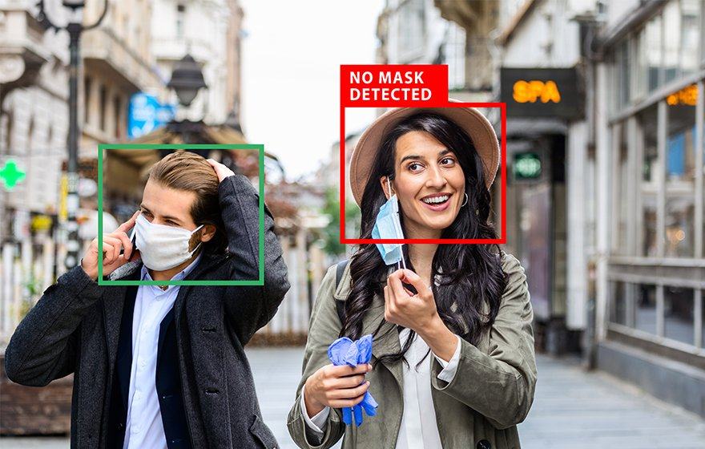

# Face Mask Detection

A real-time face mask detection application built using OpenCV and TensorFlow. This program utilizes a pre-trained deep learning model to detect whether a person is wearing a mask or not.

---

## Features

- **Face Detection**: Detect faces in a live video feed using OpenCV's Haar Cascade Classifier.
- **Mask Classification**: Classify detected faces as "With Mask" or "Without Mask" using a pre-trained TensorFlow model.
- **Real-Time Feedback**: Highlight faces with bounding boxes and labels in green (With Mask) or red (Without Mask).

---

## Preview




---

## Installation

### Prerequisites

Ensure you have Python 3.8+ installed and the following libraries:

- OpenCV
- TensorFlow
- NumPy

### Steps

1. Clone the repository:
   ```bash
   git clone https://github.com/amin-Lotfi/face-mask-detection.git
   cd face-mask-detection
   ```

2. Install dependencies:
   ```bash
   pip3 install -r requirements.txt
   ```

3. Place the pre-trained model file (`model-facemask.h5`) in the root directory.

4. Run the application:
   ```bash
   python main.py
   ```

---

## Usage

1. **Start Detection**:
   - Run the script, and the program will use your webcam to detect faces.
   - Detected faces are classified as "With Mask" or "Without Mask".

2. **Exit**:
   - Press the `q` key to exit the application.

---

## File Structure
```
face-mask-detection/
├── image/
│   ├── covid19-appl-880x560_a2.jpg
│   ├── Screenshot from 2024-12-27 14-52-53.png
│   └── test.mp4
├── model-facemask.h5
├── main.py
└── README.md
```

---

## Contributing

Contributions are welcome! Please fork the repository, create a new branch, and submit a pull request.

---

## Contact

For any inquiries or issues, feel free to reach out at:

- Email: aminlotfi.ogl@gmail.com
- GitHub: [amin-Lotfi](https://github.com/amin-Lotfi)
